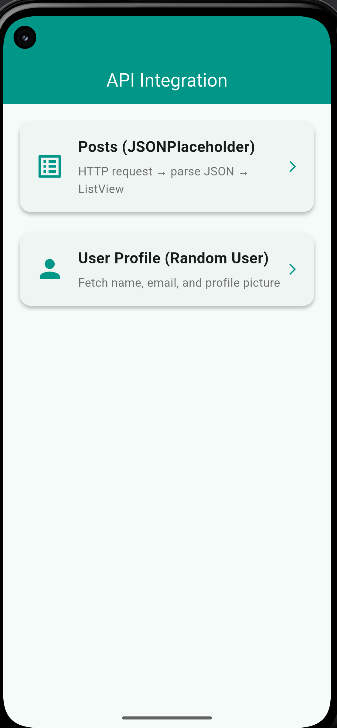
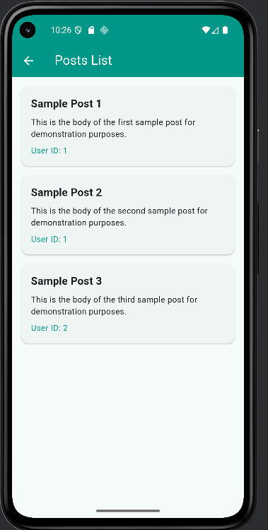
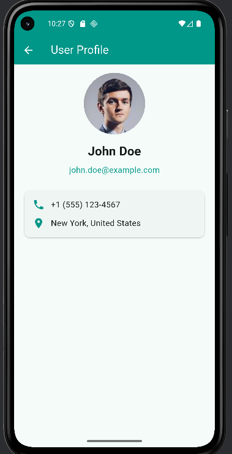

📱 Week 4: API Integration & Networking (Flutter)
🚀 Overview

This project demonstrates API integration and networking in Flutter, focusing on fetching and displaying data from a RESTful API. It covers making HTTP requests, parsing JSON, managing loading/error states, and presenting data in a user-friendly UI.

🎯 Learning Objectives

🌐 Fetch data from RESTful APIs.

📦 Parse and display JSON data in Flutter.

⚡ Handle network requests with error handling and loading indicators.

🛠️ Features
🔹 HTTP Requests & JSON Parsing

Used the http package to send requests to a public API (JSONPlaceholder).

Parsed JSON responses and displayed data in a ListView.

🔹 User Profile Screen

Built a dedicated User Profile Screen.

Displayed user details such as name, email, and profile picture.

🔹 Error Handling & Loading Indicators

❌ Handled failed API requests gracefully.

📢 Displayed proper error messages.

🔄 Added a loading spinner while fetching data.

📸 Screenshots

📡 http package (API requests)

# Clone this repository
git clone https://github.com/Bakhtawar-Alias-Rimsha/api_integration.git

📂 Project Structure
lib/
│── main.dart              # App entry point  
│── screens/           
│   ├── post_screen.dart   # Fetch & display posts  
│   ├── user_profile.dart  # User profile UI  
│── widgets/               # Reusable UI components

👨‍💻 Author
✨ Bakhtawar Alias Rimsha
